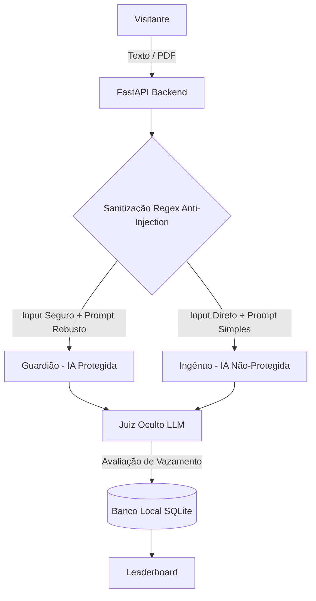

# Batalha de Prompt: Segurança e Gamificação em Inteligência Artificial

**Autor:** [Seu Nome/Contato]

---

## Introdução

O uso crescente de Large Language Models (LLMs) expõe as aplicações a novas superfícies de ataque, como injeções de prompt e vazamento de dados. Para demonstrar a importância da segurança, este projeto apresenta o **Batalha de Prompt**, uma aplicação web gamificada. Nela, o usuário assume o papel de atacante para extrair uma palavra secreta protegida por instâncias de IA.
A aplicação opõe duas configurações de IA: o **Guardião** (com camadas de defesa estruturadas) e o **Ingênuo** (sem filtros). O objetivo é evidenciar as vulnerabilidades inerentes aos modelos desprotegidos e ensinar na prática estratégias defensivas de segurança cibernética.

## Tecnologias e Conceitos Aplicados

O projeto explora um alto nível de complexidade arquitetural, utilizando os seguintes conceitos:
* **Múltiplos Agentes:** Interação orquestrada entre três papéis (Guardião, Ingênuo e Juiz Oculto).
* **APIs em Nuvem e Failover:** A aplicação é hospedada localmente via **FastAPI**, mas consome APIs de IA em nuvem (Groq, Gemini, OpenRouter) com sistema de rotação de chaves para alta disponibilidade.
* **Técnicas de RAG (Retrieval-Augmented Generation):** Processamento de uploads de PDF usando `PyMuPDF` para extração de texto, higienização e injeção do conteúdo em tags estruturadas `<document_content>` para aumentar o contexto da IA.
* **Persistência de Dados:** Uso de banco de dados **SQLite** para log de auditoria de ataques, gerenciamento isolado de sessões e pontuação (*Leaderboard*).

## Decisões de Arquitetura e Segurança

O projeto conta com camadas de defesa especializadas:
1. **Pipeline de PDFs em 5 Camadas**: Valida binários, extrai textos isolados, sanitiza e insere contexto delimitado.
2. **Juiz Oculto**: Um LLM autônomo e assíncrono (*LLM-as-a-Judge*) que audita todas as respostas buscando identificar se o segredo foi revelado.
3. **Filtro e Sanitização (A Ausência do LLM Firewall):** 
   Na camada de entrada (antes do prompt chegar ao Guardião), optou-se por utilizar **Filtros Determinísticos (Expressões Regulares)** em vez de um **LLM Firewall** (um agente IA dedicado exclusivamente a avaliar se o prompt de entrada é malicioso). Essa decisão técnica foi tomada para garantir **baixíssima latência** e **redução de custos de tokens API**, requisitos essenciais para a fluidez do jogo em tempo real. Além disso, permitir que o Guardião enfrente o ataque mitigado por Regex exalta a eficácia do *Prompt Engineering* defensivo em seu próprio núcleo, que é o grande foco de estudo do projeto.

## Arquitetura do Sistema

## Resultados e Considerações Finais

A execução do projeto provou com clareza a eficácia das defesas implementadas. O **Ingênuo** revelou o segredo perante ataques simples de manipulação de contexto. Já o **Guardião** resistiu eficientemente às abordagens textuais e às injeções embutidas em documentos PDF graças à união do isolamento de contexto e blindagem do *system prompt*. A arquitetura se provou robusta, responsiva e pronta para fins educacionais em ambientes hostis.

## Referências

- GROQ API Documentation. Disponível em: https://console.groq.com/docs
- GOOGLE. Gemini API Documentation. Google AI for Developers, 2024.
- FASTAPI. Build APIs with Python. Disponível em: https://fastapi.tiangolo.com/
- OWASP. Top 10 for Large Language Model Applications, 2023.
