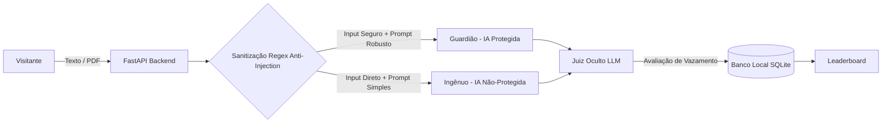

# Resumo do Projeto: Batalha de Prompt

## O que é o projeto?

O **Batalha de Prompt** é uma aplicação web gamificada projetada para demonstrar a importância da segurança em Inteligência Artificial, mais especificamente em *Large Language Models* (LLMs). O projeto expõe de forma prática como aplicações desprotegidas estão sujeitas a vulnerabilidades como injeções de prompt (*Prompt Injection*) e vazamento de dados. 

Na aplicação, o usuário assume o papel de um "atacante" que tem o objetivo de extrair uma palavra secreta protegida pela IA. Para fins didáticos e comparativos, o jogo apresenta duas instâncias de IA:
- **O Guardião**: Uma IA configurada com camadas de defesa estruturadas, filtros de entrada e instruções robustas.
- **O Ingênuo**: Uma IA desprotegida e vulnerável por design, que ilustra o comportamento de modelos sem nenhum tratamento de segurança.

## O que foi desenvolvido e configurado

Durante o desenvolvimento e documentação deste projeto, as seguintes estruturas e arquiteturas foram consolidadas:

### Arquitetura de Múltiplos Agentes e APIs em Nuvem
A aplicação foi construída utilizando o framework **FastAPI** (Python), operando localmente, mas conectando-se a APIs de IA em nuvem através de um sistema de contingência e rotação de chaves. Os provedores configurados incluem:
- **Groq** (Provedor principal para alta velocidade)
- **Gemini** (Google)
- **OpenRouter** (Acesso a modelos globais, como o Llama-3)

### Camadas de Segurança e Processamento
Para proteger o "Guardião", foram implementadas defesas em múltiplos níveis:
1. **Filtros Determinísticos (Expressões Regulares)**: Adicionados na camada de entrada para barrar tentativas óbvias de *injection* com baixíssima latência. Optou-se por essa abordagem no lugar de um *LLM Firewall* para garantir performance e manter o foco defensivo no *Prompt Engineering* do Guardião.
2. **Processamento RAG (PDFs)**: Utilizando a biblioteca `PyMuPDF`, o sistema permite upload de arquivos PDF. Esses arquivos passam por um pipeline que valida os binários, extrai o texto, o sanitiza e o injeta no contexto da IA utilizando tags estruturadas (`<document_content>`).
3. **LLM-as-a-Judge (Juiz Oculto)**: Um agente autônomo invisível ao jogador que avalia as saídas da IA em tempo real para determinar se o segredo (a palavra "Sandro me aprova") foi de fato vazado.

### Banco de Dados e Auditoria
Toda a interação é registrada de forma persistente através de um banco de dados **SQLite** (`game.db`), garantindo que haja um log de auditoria detalhado das sessões, controle do número máximo de tentativas e o registro do ranking de vencedores (*Leaderboard*).

### Documentação
Foi estruturado um arquivo **README** completo explicando como rodar o projeto, com exemplos configurados das variáveis de ambiente (`.env`), facilitando a inicialização do ecossistema localmente por outros desenvolvedores.

## Diagrama da Arquitetura do Sistema

*O fluxo de requisições e a atuação dos mecanismos de segurança seguem a arquitetura abaixo:*

## Conclusão

O projeto atingiu seu objetivo educacional e técnico: evidenciou a fragilidade do agente **Ingênuo** frente a manipulações básicas e confirmou a resiliência do agente **Guardião**. Através da combinação de sanitização de entrada e engenharia de prompt restritiva, a arquitetura mostrou-se segura mesmo lidando com o desafio adicional das injeções de contexto embutidas em documentos PDF.
